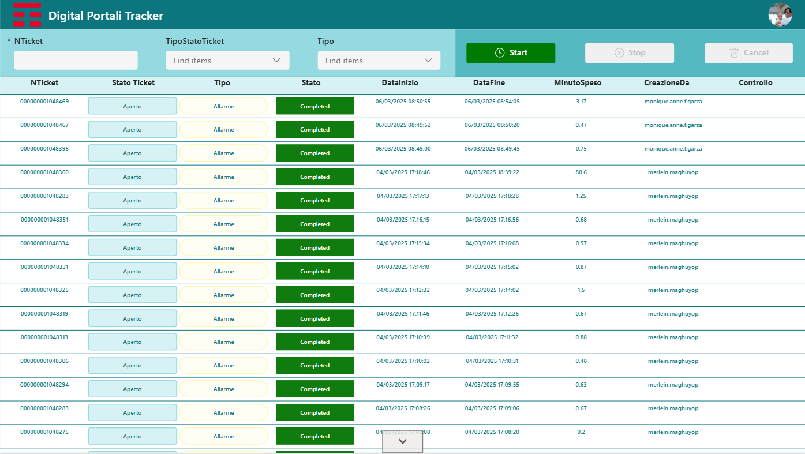

# PowerApp Ticket Tracker

## Description
PowerApp Ticket Tracker is a project management tool designed to help teams track and manage their tasks and issues efficiently using Microsoft PowerApps.

## Features
- Create, update, and delete tickets
- Track the status of tickets
- Track the time spent on each ticket by users

## Installation
1. Download the `TicketTracker_20250306145843.zip` file from the repository.
2. Open PowerApps Studio.
3. Click on "Open" and select "Browse".
4. Navigate to the location where you downloaded the `TicketTracker_20250306145843.zip` file and select it.
5. Click on "Open" to import the app.

## Usage
1. Open the PowerApp Ticket Tracker in PowerApps.
2. Create a new ticket by clicking on the "New Ticket" button.
3. Fill in the ticket details.
4. Track the status of the ticket and update it as needed.
5. Track the time spent on each ticket by users.

## Screenshot


## Contributing
1. Fork the repository.
2. Create a new branch:
    ```sh
    git checkout -b feature/your-feature-name
    ```
3. Make your changes and commit them:
    ```sh
    git commit -m 'Add some feature'
    ```
4. Push to the branch:
    ```sh
    git push origin feature/your-feature-name
    ```
5. Open a pull request.

## License
This project is licensed under the MIT License.